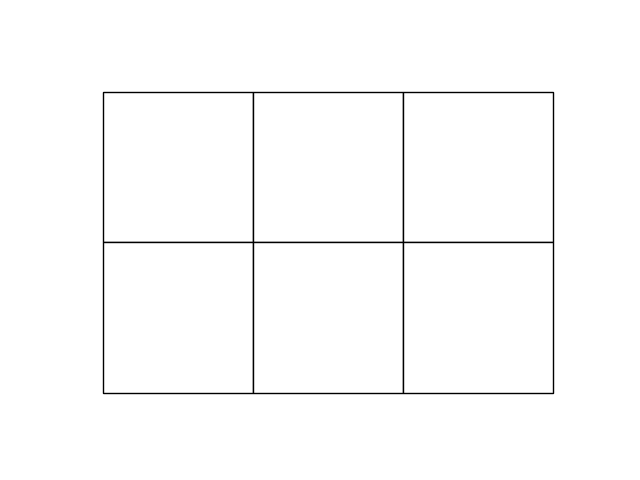
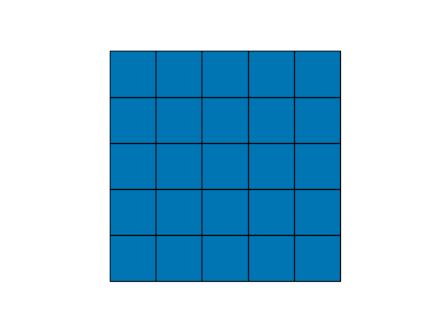

# TowerBlocksOptimizer

Optimize the city layout for games like City Bloxx and Tower Bloxx ([play online](https://www.gameflare.com/online-game/tower-bloxx/)).

In these games, players are challenged to build the optimal city by placing towers on a rectangular grid. There are four types of towers that increase in score, but are also increasingly more difficult to place.

1. Blue: blue towers can be placed without any requirements.
2. Red: red towers require a **blue** neighbor at the time of construction.
3. Green: green towers require a **blue** and a **red** neighbor at the time of construction.
4. Yellow: yellow towers require a **blue**, a **red**, and a **green** neighbor at the time of construction.

Every cell has at most four neighbors: up, down, left, right.
The rules only apply when a tower is placed, and new towers may replace existing towers.

## Example



* The blue tower is placed without requirements.
* The red tower can be placed because it has a blue tower as a neighbor.
* Another blue tower is placed in the top-right corner to enable the construction of a green tower, which requires both a blue and a red neighbor.
* A new red tower in the bottom-right corner enables the construction of a yellow tower, which requires blue, red, and green neighbors.
* A blue tower is placed in the top-left corner, replacing the existing tower. The green tower no longer has a red neighbor. This is not an issue as the rules only apply _when the tower is placed_.
* A red tower is constructed in the bottom-left corner. This requires the blue neighbor in the top left.

## Scoring
The final score is calculated by adding up the points for each tower in the _final_ configuration; it does not matter which moves were used to reach this configuration.

The scoring varies with different variants of the game:
* Tower Bloxx: Blue: 205, Red: 966, Green: 2677, Yellow: 5738 (source: moderator 'towr' on the [wu :: forums](https://www.ocf.berkeley.edu/~wwu/cgi-bin/yabb/YaBB.cgi?board=riddles_easy;action=display;num=1287572914)).
* Simple: Blue 1, Red: 2, Green: 3, Yellow: 4.
* Yellow only: Blue: 0, Red: 0, Green: 0, Yellow: 1.

## Installation
`TowerBlocksOptimizer` has been tested with Python ≥ 3.9.
Simply clone or download the code and set up a virtual environment.
First upgrade pip:
```
python -m pip install pip --upgrade
```
and then pip install the packages listed in `python_requirements.txt`:
```
python -m pip install -r python_requirements.txt
```
The script `main.py` provides an example for how to use the optimizer. 

## Best known configurations
The following best known configurations were found with `TowerBlocksOptimizer`.
Note that there may be other configurations with the same score, but the scores marked with (optimal) cannot be increased further.
The number of steps it takes to get to this configuration has not been optimized.

### 5 x 5

* Tower Bloxx scoring: 95691 (optimal) + Yellow only scoring: 13 (optimal):



* Simple scoring: 81 points (optimal):


### 10 x 10

* Yellow only scoring: 58 (optimal):


